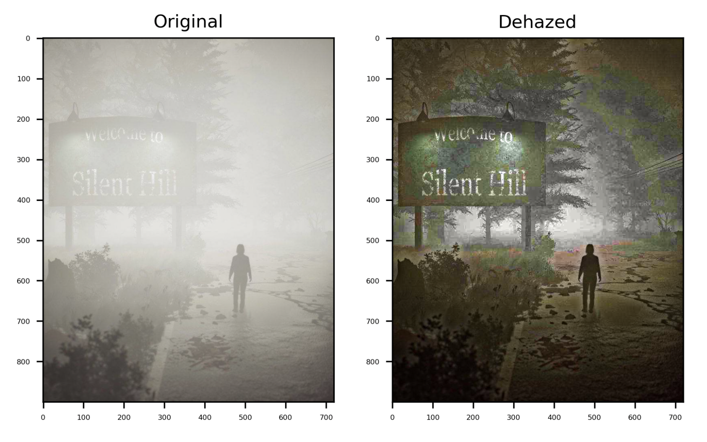
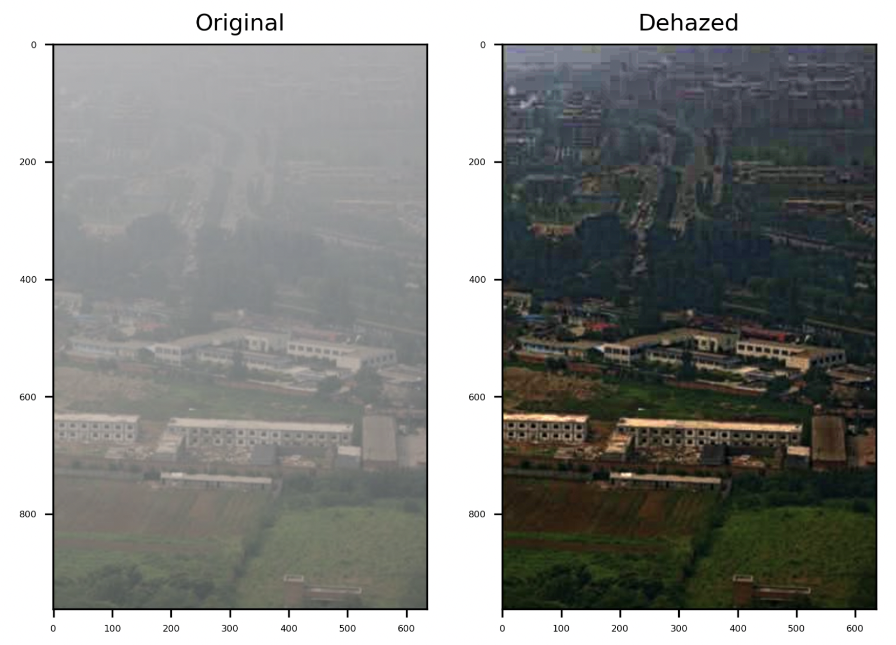
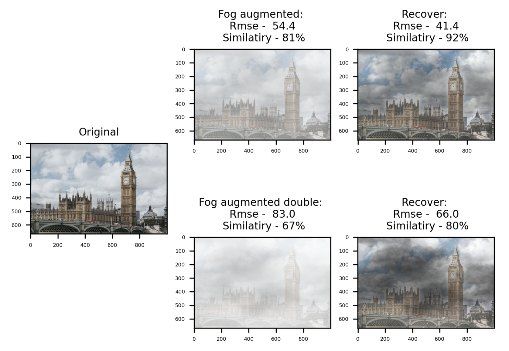
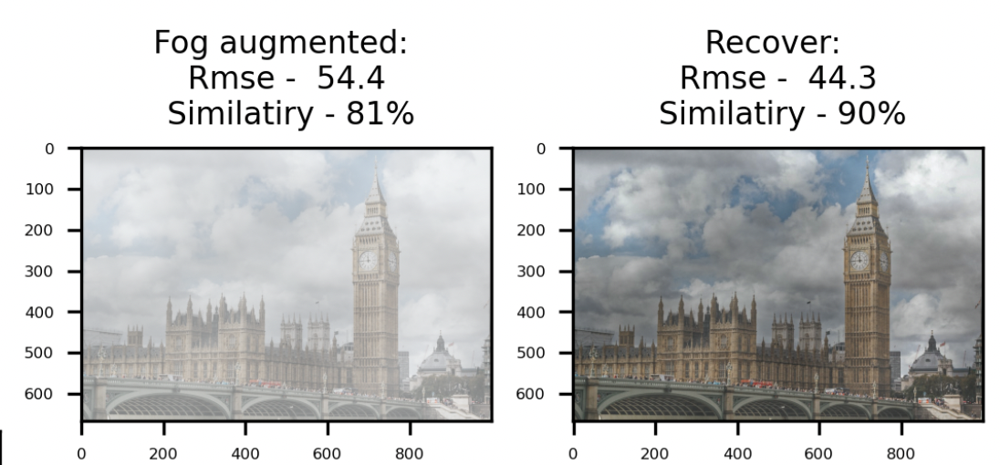
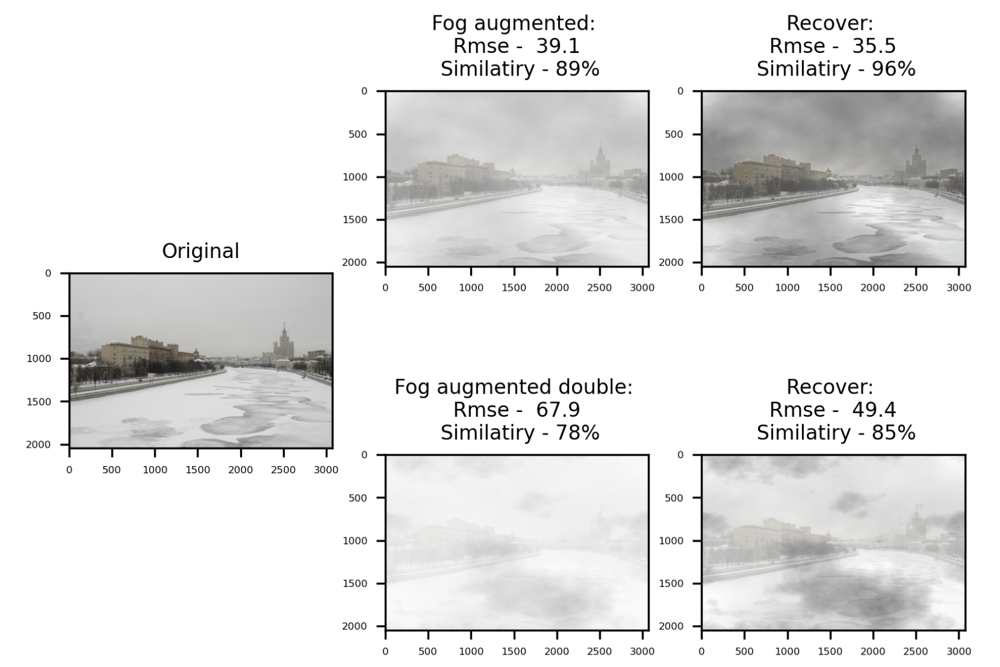
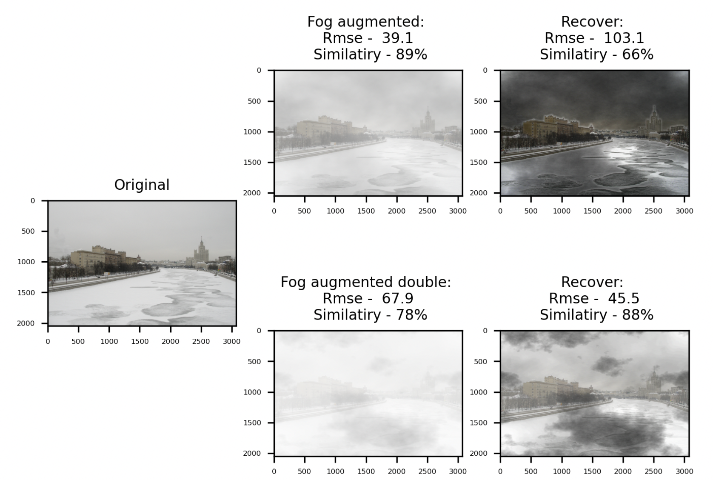

# HSE image project

## Ilyushin Stanislav
## Dehazing images using DCP

### Введение. Состав проекта.

* _В папке [images_nohaze](images_nohaze) находятся фотографии без естественного тумана на которые аугментировалась дымка для проверки качества алгоритма_
* _В папке [test_images_hazed](test_images_hazed) находятся фотографии с туманом_
* _Файл [DCP.py](DCP.py) реализует в себе оболочку алгоритма Dark Channel Prior_
* _Файл [Guided_filter.py](Guided_filter.py) реализует в себе управляемый фильтер (Guided Filter + Box Filter) импортируемый в DCP.py_
* _Сам проект визуально реализован в отчете [Inference.ipynb](Inference.ipynb)_

### Imports. Requirements

1. Библиотеки испльзующиеся для базовых алгоритмов и оболочек, а также визулизации и некоторых предобоработок фото
  * Numpy, Scipy, OpenCv, Matplotlib
2. Либа используемая для генерации тумана [imgaug](https://imgaug.readthedocs.io/en/latest/)
3. Вспомогательные либы для расчета метрик и оптимизации
  * Scikit-image, itertools
```Bash
    pip install imgaug
    pip install scikit-image
```

### Results

**Часть с естественным туманом**

Привожу выкладки из *Inference.ipynb* 

Для настоящего тумана привожу два варианта отработки на двух фотографиях
 
* В этом случае, на мой взгляд, алгоритм отработал достаточно хорошо, но возможно из-за того что фотография и сам туман на ней мог быть синтетически сгенерирован, хотя кадр взят из фильма 
* В данном случае пример из лекции по данной теме, результат визуально почти совпал, с толикой того, что в моем аутпуте больше затемнений 

**Часть с сгенерированным туманом**

В данном случае основной упор, кроме отработки алгоритма, я делал на подбор гиперпараметров относительно уровня аугментированного тумана, здесь я добавлял к фотографиям единижды аугментированный туман и дважды аугментированный туман с одинаковой вероятностной генерацией, на двух аугментированных фотографиях я оптимизировал гипперпараметры по средней метрике батча выбранных фотографий для аугментации, выбор происходил как для метрики RMSE так и для метрики Structur Similarity для каждого батча фотографий (единожды сгенерированного тумана и дважы сгенерированного тумана), в основном сильную роль на качество сыграло два паказателя: степень влияния DCP имплементации к фотографии и размер ядра фильтра
* Для единожды сгенерированного тумана по метрике RMSE - размер ядра 5 и степень влияния (omega) - 0.75, по метрике SS размер ядра - 5 и степень влияния - 0.8
* Для дважды сгенерированного тумана по метрике RMSE - размер ядра 5 и степень влияния (omega) - 0.9, по метрике SS размер ядра - 5 и степень влияния - 0.9
* Для единожды сгенерированного тумана оставил размер ядра - 15 (далее скажу почему) и степень влияния 0.8
* Остальные параметры, касающие изменения радиуса и порогов управляемого фильтра не дали ощутимого результата по метрикам

* Касательно размера фильра малого ядра. По уровню аугментации тумана малое ядро хорошо работает при восстановлении картинок, если исходные сильно задымленные при отсутствии естественных источников напоминающих по цветой гамме туман - облака, облачность, лед, либо цвет окружения, при этом среднее качество именно на таких картинках растет (но немного так как размер фильтра что в малых что в средних значениях размера хорошо различает туман), но при этом более агрессивно работает на фотографиях с наличием естественных природных эффектов похожих по цветовой гамме на туман, поэтому происходит естественное затемнение, например облаков, как в случае с Биг Беном при размере ядра 5 

* Такое же явление можно увидеть и с параметром omega (степень влияния DCP) - подбор параметра сильно зависит от выборки фотографий и их естественного окружения, например для выборки я взял утреннюю пасмурную Москву:
* Москва на степени DCP 0.7 
* Москва на степени DCP 0.9 
* Высокий показатель улучшает качество почти всех картинок без естественных преград + сравнительно лучше работает на сильно сгененерированном тумане при прочих равных, но просаживается на легком тумане с сильными атмосферными или искуственными помехами, таким образом подборка параметров (если строить фильтр в pytorch) сильно зависит от качества и вариативности входных данных и лучше строить модели априорно (если вдруг не знаем ввод и не можем поправить ничего) на квантилях распредения соотношения баланса света в исходных тестовых наборах и применять несколько иерархических схожих моделей типа CNN
* PS: также при подборе параметров и оценки качества влияния необходимо независимо оценивать по разным метрикам RMSE и SSIM ибо в вышеперечисленных случаях возможны нестыковки по росту/падению качества (например при оптимизации по картинкам с облаками/облачностью сталкивался что RMSE оригинал/восстановленная растет относительно оригинал/фото с туманом, но при этом растет схожесть в тех же сравнениях)

**В остальном, с основными результатами и визуальным сравнением можно ознакомиться [здесь](Inference.ipynb)**
